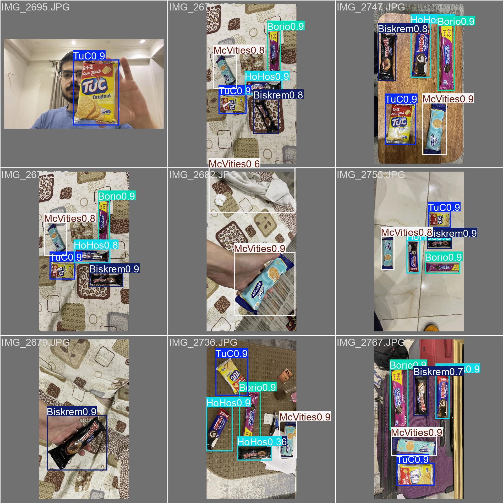

# Candy Calorie Counter

[](https://candy-calorie-counter-using-yolo-11.streamlit.app)

A computer vision application that uses a custom YOLO11s model to detect candies from images, USB cameras, or video files and tally total calories and sugar content.

## Overview

This project provides three ways to use the model:

- **`app/app.py`** — Streamlit web app. Upload a photo or pick a sample image to detect candies and see calories/sugar instantly. [Try it live](https://candy-calorie-counter-using-yolo-11.streamlit.app).
- **`scripts/candy_calorie_counter.py`** — Real-time detection from a USB camera or video file with live calorie/sugar tallying.
- **`scripts/yolo_detect.py`** — General-purpose YOLO inference script supporting images, folders, videos, USB cameras, and Raspberry Pi cameras.

## Video Tutorial

[](https://www.youtube.com/watch?v=ydU6nrFXrsw)

## Requirements

- Python 3.8+
- [Ultralytics YOLO](https://github.com/ultralytics/ultralytics)
- OpenCV (`opencv-python-headless` for cloud, `opencv-python` for local)
- NumPy
- Streamlit
- A custom-trained YOLO model (e.g., `my_model.pt`)

## Files

| File / Directory | Description |
|------------------|-------------|
| `app/app.py` | Streamlit web app for image-based candy detection |
| `scripts/candy_calorie_counter.py` | Real-time candy detection and nutrition tallying |
| `scripts/yolo_detect.py` | General-purpose YOLO detection script |
| `model/my_model.pt` | Custom YOLO model weights |
| `docs/Training The Model.ipynb` | Google Colab notebook for training the YOLO model |
| `samples/images for testing/` | Sample test images |
| `samples/val_batch0_pred.jpg` | Validation results visualization |
| `requirements.txt` | Python dependencies |
| `LICENSE` | MIT License |

## Project Structure

```
Candy Calorie/
├── app/
│   └── app.py                    # Streamlit web app
├── scripts/
│   ├── candy_calorie_counter.py  # Real-time detection + nutrition tally
│   └── yolo_detect.py            # General-purpose YOLO inference
├── model/
│   └── my_model.pt               # Trained YOLO11s weights
├── samples/
│   ├── images for testing/       # 5 sample test images
│   ├── IMG_2784.MOV              # Demo video
│   └── val_batch0_pred.jpg       # Validation results visualization
├── docs/
│   └── Training The Model.ipynb  # Google Colab training notebook
├── .gitignore
├── LICENSE
├── README.md
└── requirements.txt
```

## Deployment

The Streamlit app is deployed on [Streamlit Community Cloud](https://share.streamlit.io) — push to GitHub, connect your repo, and it deploys automatically. The app runs fully in the browser; inference happens on the cloud server.

## Model Training

### Annotation

Images were annotated using [MakeSense.ai](https://www.makesense.ai/), a free online tool that requires no installation. After annotating all images, export the results — you'll get a `data` folder containing `images/` and `labels/` directories with YOLO-format annotation files.

### Training

Create a `classes.txt` file with one class name per line (matching your annotation labels), then use the `Training The Model.ipynb` notebook on Google Colab:

1. **Environment setup** — Verifies GPU (Tesla T4) and installs Ultralytics
2. **Data preparation** — Copies the labeled dataset from Google Drive, splits into train (90%) / validation (10%) sets
3. **Configuration** — Auto-generates `data.yaml` from `classes.txt` (5 candy classes: `TuC`, `HoHos`, `McVities`, `Borio`, `Biskrem`)
4. **Training** — Trains a YOLO11s model for 60 epochs at 640px resolution
5. **Evaluation** — Achieves ~0.995 mAP50 on validation set (9 validation images, 74 training — 85 total)
6. **Deployment** — Packages the trained weights as `my_model.pt`

Despite the relatively small dataset (85 images), the model achieved very high accuracy thanks to transfer learning from the pretrained YOLO11s backbone.

To train your own model, open the notebook in Google Colab and follow the steps.

## Validation Results

Despite only having 9 validation images (from a 85-image dataset), the model achieved ~0.995 mAP50 with near-perfect precision and recall across all classes.



The trained model can also be deployed on edge devices like Raspberry Pi and other single-board computers. Ultralytics YOLO supports exporting to various formats (TensorFlow Lite, ONNX, CoreML, etc.) for different hardware — converting the model format is straightforward but not covered in this guide.

## Usage

### Streamlit Web App

```bash
streamlit run app/app.py
```

### Candy Calorie Counter

```bash
python scripts/candy_calorie_counter.py
```

**Configuration** — Edit the top of `candy_calorie_counter.py` to change:
- `cam_index` — Set to `0` for USB camera, or a video file path like `"IMG_2784.MOV"` in quotes
- `model_path` — Path to the YOLO model (default: `model/my_model.pt`)
- `min_thresh` — Confidence threshold (default: `0.50`)
- `record` — Set to `True` to save output as `demo1.avi`
- `nutrition_info` — Dictionary of `{'candy_name': [calories, sugar_g]}` to customize candy types and nutritional values

Key bindings while running:
- **q** — Quit
- **s** — Pause/Resume
- **p** — Save screenshot (`capture.png`)

### General YOLO Detection

```bash
python scripts/yolo_detect.py --model model/my_model.pt --source usb0 --thresh 0.5 --resolution 1280x720
```

Arguments:
- `--model` — Path to YOLO model
- `--source` — Image file, folder, video file, `usb<N>`, or `picamera<N>`
- `--thresh` — Confidence threshold (default: 0.5)
- `--resolution` — Display resolution as `WxH` (optional)
- `--record` — Record output video (requires `--resolution`)

## Candy Nutrition Reference

| Candy | Calories | Sugar (g) |
|-------|----------|-----------|
| TuC | 146 | 2.2 |
| HoHos | 259 | 24 |
| Borio | 170 | 13 |
| McVities | 220 | 18 |
| Biskrem | 171 | 12 |
